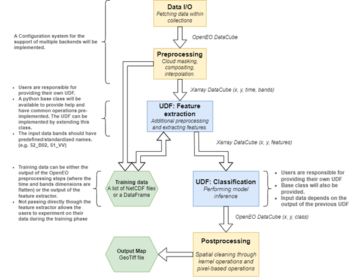

# OpenEO General Framework for Mapping

Openeo GFMap aims to simplify for its users the development of mapping applications through Remote Sensing data by leveraging the power of [OpenEO](https://openeo.org/). This framework is developped primarely for Crop Type mapping and Land Cover Classification, but other applications such as regression tasks can be applied.

## How is it used?

In order to be used, the user has to specify which kind of input data it expects (satellite, meteo, DEM, ...) and which mode of classification it expects (point based mapping or polygon based). The user specifies then two <i>user defined files (UDF)</i>, one for exctractive features from the pre-processed data and the other for performing classification through a model.

The Frameworks provides assistance in extraction of training data as well as inference phase, and makes sure that both training data and inference data are processed the same way before passing through the model. The user is responsible for the machine learning related details, and for the training phase itself.

    

## Framework core principles

1.	<b>Backend agnostic</b>: The users shouldn’t have to take care of backend related configurations. The use of OpenEO can vary depending on the backend that is currently in use (for example, the name of data collections). The framework takes care of those differences, while the users only specify the backend they desire to use.

2. <b> Data consistent</b>: providing a common pipeline for training and for inference. The best way of making sure data is processed the same way during the construction of a training dataset than during inference, is to re-use as much as code as possible. The users should be able to extract and preprocess training data with the same configuration. OpenEO leaves the possibility to perform data extraction on sparse points/polygons or directly on dense datacubes. This leaves the possibility to implement a framework that could do both tile-based inference and pixel-based or parcel-based data extraction/preprocessing using the same code.

3. <b>Easy and Collaborative</b>: Pre-implementing common preprocessing/postprocessing routines. Many operations, such a compositing or linear interpolation, are very common within Remote Sensing applications and should be already implemented in the framework. This will avoid code duplication among the personal code of the framework’s users and encourage collaboration for improvement and optimization of existing techniques.

4.	<b>Performant</b>: Leverage OpenEO processes as much as possible for preprocessing. In the cropclass and worldcereal projects, preprocessing is performed with a combination of OpenEO processes (masking, compositing, linear interpolation) and the implementation of a Feature Extractor within an UDF (computing indices, percentiles). Ideally, OpenEO features should be used as much as possible, while the features extractor should be as simple as possible, only implementing what is currently not possible within OpenEO.
